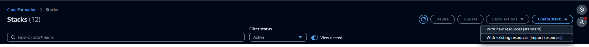
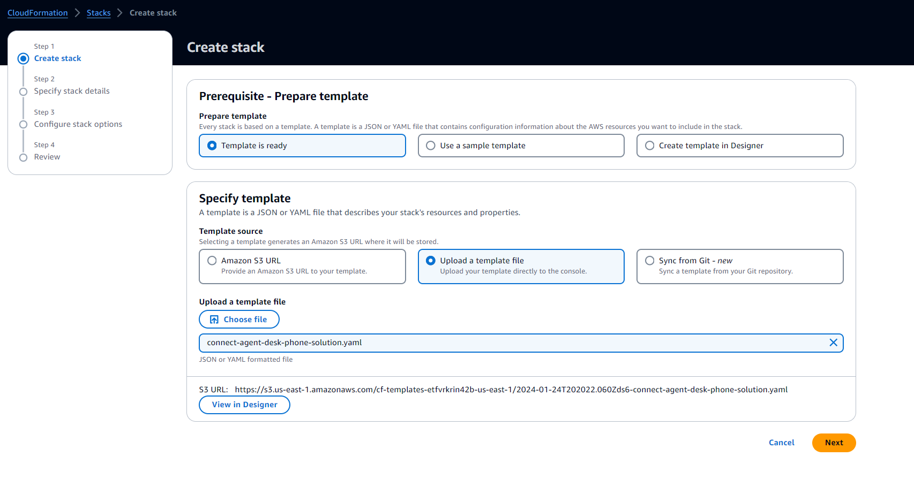
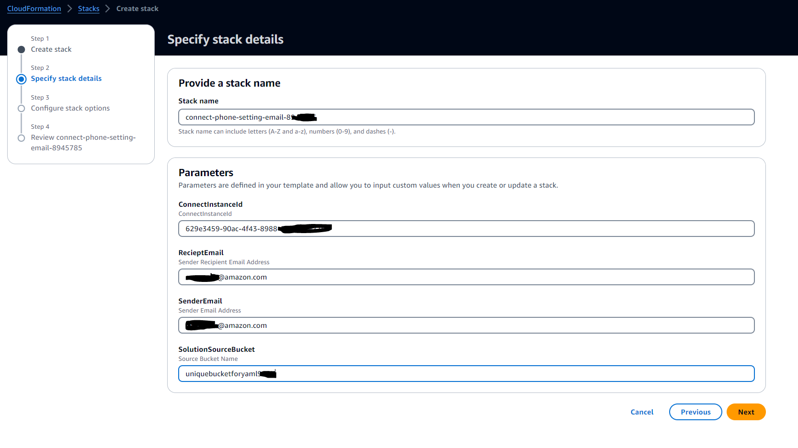
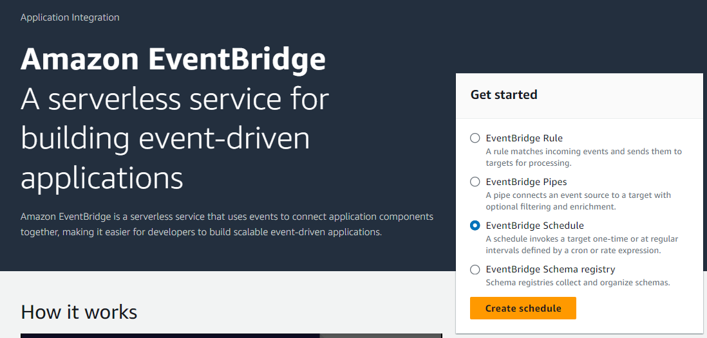
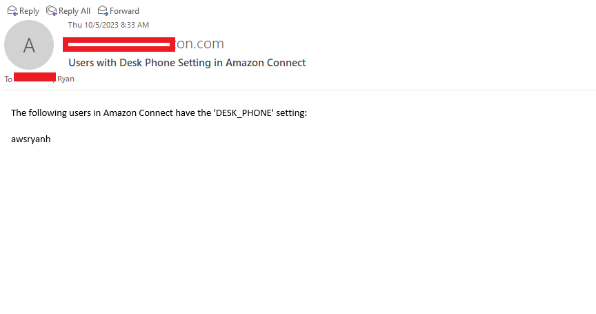

# Amazon Connect Desk Phone Email

In Amazon Connect, agents have the option to receive calls via SOFT_PHONE or DESK_PHONE. Using the DESK_PHONE incurs additional cost for the PSTN call leg and Supervisors don't have a way to detect agents using this option.

This solution walks you through how to automatically send an email alert when users are using the DESK_PHONE setting in Amazon Connect CCP or workspace.

This example provides a Python 3.11 Lambda Function that will look at all users in Connect to find which users have their CCP set to DESK_PHONE and send an email with that user list.\
This option can be disabled in a custom CCP by settign the following:

enablePhoneTypeSettings: false\
But if using out of the box CCP or workspace this is not an option.

<h5>Instructions to setup Lambda function via CloudFormation template:</h5>

1. Login to the AWS console and navigate to the [S3 service](https://aws.amazon.com/s3/) and click Create bucket in the upper right hand corner
2. Provide a Unique name of the bucket then scroll down adn clikc Create bucket
3. Download [index.py script](index.py)
4. In the AWS console navigate to the service CLoudFormation
5. Click Create stack in upper left hand corner: 
6. Select “With new resources (standard)”
7. Select Upload a Template
8. And then Choose file and select the [YAML file downloaded previously](index.py)  
9. Click Next
10. Provide a stack name
11. Fill out the parameters \
    	1. Connect Instance ID  [How to locate your Amazon COnnect Instance ID](https://docs.aws.amazon.com/connect/latest/adminguide/find-instance-arn.html) \
        2. RecieptEmail (Sender Recipient Email Address) \
        3. SenderEmail (Sender Email Address) \
        4. SolutionSourceBucket (bukcet name provided in Step 2 above) \

   
   
								   
																																																								   
																																						 
																																 
													
																																		 
																																
									

<h5>Instructions to schedule this Lambda function to run every X minutes:</h5>

1. Search in the AWS Console for the services [Amazon EventBridge](https://aws.amazon.com/pm/eventbridge/)
2.  Select EventBridge Schedule and click Create Schedule: 
3. Give the Schedule a name and Description. Under schedule pattern select Recurring Schedule. Select the Schedule type as Rate-based Schedule and set the Rate to something like 15 minutes. And set Flexible time window to *Off*
4. This means the lambda will run and check for users with the DESK_PHONE settign every 15 minute. You can define how often you wish for this lambda to check.
5. Give a date and time including timezone for when you want the lambda to fist kick off. Leave End date and time blank and click next
6. Select Lambda from the list of templated targets
7. Scroll down and from the Lambda function list, select the lambda you deployed previously. Don't worry about the payload and click Skip to Review and create schedule.
9. Review and click Create Schedule.

Once everything is all set up you will receive an email with all users who have their CCP / Workspace set to use the DESK_PHONE option emailed to you:\

